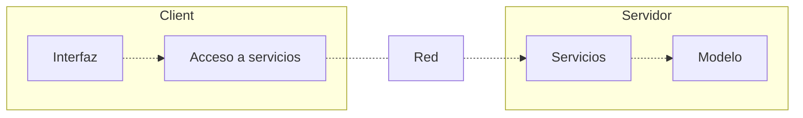

# Descripción del caso de estudio
El caso de estudio se basa en un cliente con una capa interfaz de usuario y una acceso a servicios, por otro lado tenemos el servidor con su capa servicios y modelo. Esta arquitectura asegura que cada capa modelo solo conozca a la directamente inferior a ella.

# Servicios REST
# Diseño e implementación