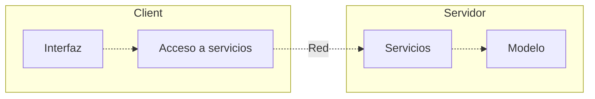

# Descripción del caso de estudio
El caso de estudio se basa en un cliente con una capa interfaz de usuario y una acceso a servicios, por otro lado, tenemos el servidor con su capa servicios y modelo. Esta arquitectura asegura que cada capa modelo solo conozca a la directamente inferior a ella.

# Servicios REST

## Stateless
Servicios sin memoria de estado sobre los clientes. Esto da ventajas como la fácil replicación y balanceo de carga al no reservar recursos, el inconveniente de este acercamiento es la necesidad de enviar ciertos datos múltiples veces.
## Métodos
Los principales métodos de un servicio REST:
- GET, petición de información.
- POST, envió de información.
- PUT, carga de información en el servicio.
- DELETE, eliminado de información en el servicio.

# Diseño e implementación
