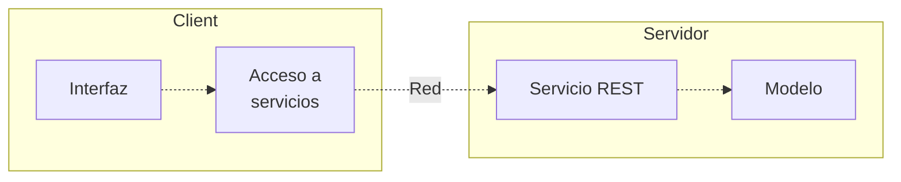
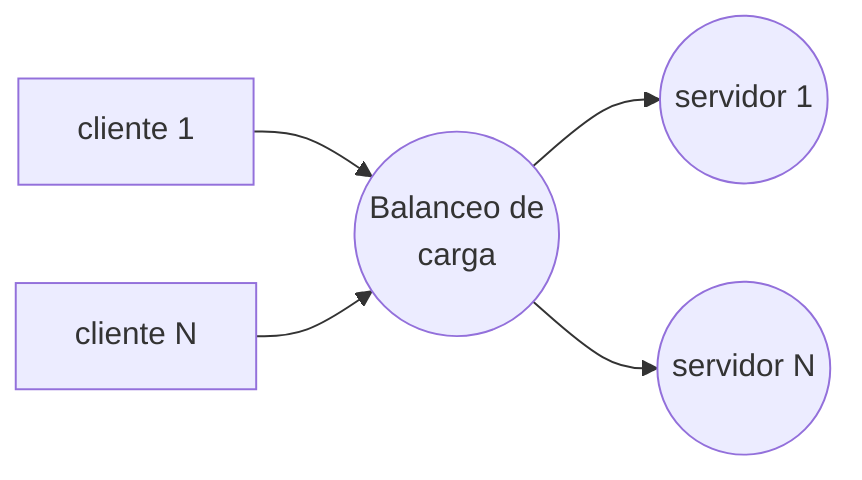
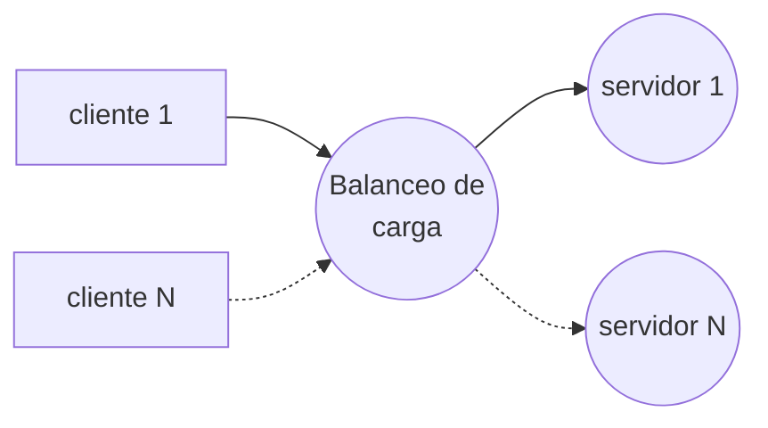
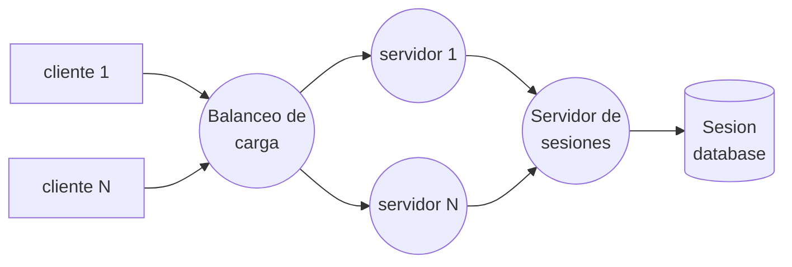
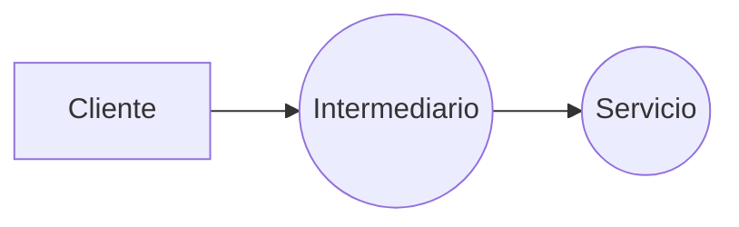
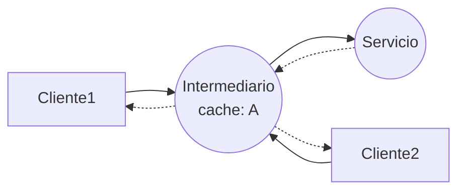

# Descripción del caso de estudio
El caso de estudio se basa en un cliente con una capa interfaz de usuario y una acceso a servicios, por otro lado, tenemos el servidor con su capa servicios y modelo. Esta arquitectura asegura que cada capa modelo solo conozca a la directamente inferior a ella.

# Servicios REST
## Métodos
Los principales métodos de un servicio REST:
- GET, petición de información.
- POST, envió de información.
- PUT, carga de información en el servicio.
- DELETE, eliminado de información en el servicio.
## Stateless
Servicios sin memoria de estado sobre los clientes. Esto da ventajas como la fácil replicación y balanceo de carga al no reservar recursos, el inconveniente de este acercamiento es la necesidad de enviar ciertos datos múltiples veces.

## Statefull
Servicios que conservan el estado de los clientes. Esto tiene ventajas en la comunicación al evitar la redundancia de datos en las peticiones, por otra parte, dificulta el balanceo de carga y escalabilidad al necesitar conservar los estados de los clientes entre peticiones.

Se mantiene la misma instancia para un cliente de la cual se lea asigno originalmente. Esto se puede resolver estableciendo un servidor de sesiones.

Esta opción aumenta el balance, pero reduce severamente la tolerancia a fallos al crear dos puntos críticos.
## Recursos y representaciones
Los recursos son los datos expuestos al exterior por el servicio, existiendo dos tipos:
- Colección, conjunto de recursos del mismo tipo.
- Individuales, recurso concreto de un tipo.
Los recursos son identificados por un identificador único y global (url), al invocar estos identificadores (llamada GET) obtenemos la representación (html, json, xml, …)del recurso al que le corresponden, estas representaciones son variables en el tiempo a diferencia del identificador.
## Interfaz uniforme
La interfaz uniforme es el concepto que desde cualquier equipo se acede a la misma interfaz. Tenemos las siguientes peticiones:
- GET, acceso a representaciones.
- PUT, remplaza la representación de un recurso o en caso de no existir lo genera si es permitido.
- POST, creación de recursos colección y modelado de operaciones no seguras (contenedor desastre).
- DELETE, borrado de un recurso.
### Respuestas
Las respuestas http son:
- 200, OK
- 201, Created
- 400, Bad Request
- 403, Forbidden or Permanent Error
- 404, Not Found or Temporal Error
- 410, Gone
- 500, Internal Error (no lo deberíamos ver nosotros)
Los errores podemos diferenciar si son temporales o permanentes, no establecido en http, esta distinción nos permite hacer peticiones con mayor eficiencia al saber si es solucionable con tiempo.
## Intermediarios

Replica el servicio sin hacer que el cliente ni el servicio se vean alterados. Dentro de los intermediarios tenemos tipos por función:
- Caché, almacena en caché información pedida al servicio para liberar carga del mismo, atendiendo peticiones cacheadas.

