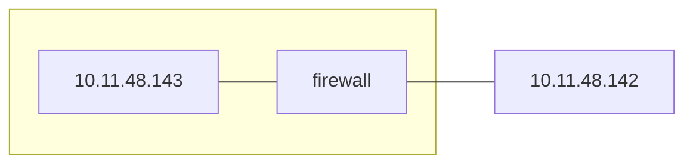

En el firewall de control de estados no olvidarse del udp.

# 1.~
SSH -v | -vw
- Ficheros de configuración (SSH_KONWN_HOST)
- Cifrado
- Clave pública INPORTANTE (devian.org info del funcionamiento)
- Securizar servicio con túnel SSH, comprobar con tráfico http y en el snifing sale tráfico codificado ssh.
- Montaje directorio compartido (dropbox), generación modificado y borrado
## A)x
## B)~
Seleccionamos el cifrado con el comando:
```shell
scp -c <cipher> <origen> <destino>
```
Los principales cifrados son:
- aes128-ctr
- aes128-cbc
- aes192-ctr
- aes192-cbc
- aes256-ctr
- aes256-cbc
- blowfish-cbc
- arcfour
- arcfour128
- arcfour256
- cast128-cbc
- 3des-cbc
### Proceso
Se establece una conexión, autentifica por el método pertinente y se cifra el mensaje, enviándolo y descifrándolo en destino.

## C)
Generamos la clave con:
```shell
ssh-keygen -t rsa
```
Enviamos la clave:
```shell
// lo setea automaticamente en authorized_keys desde la otra maquina
ssh-copy-id -i $HOME$/.ssh/id_rsa.pub lsi@10.11.50.142
```
## D)
Creamos un túnel entre nuestra máquina y la del compañero:
```shell
ssh -L 8080:10.11.48.142:80 -N lsi@10.11.50.142
```
Acedemos a nuestro compañero por el 8080:
```shell
w3m http://localhost:8080
```
## E)B
## F)
En un principio se crearía un firewall y wrapers para restringir la comunicación al servicio ssh con las ips deseadas.
# 2.B
Apache
- entidad certificadora
	- cert
	- easy-rsa (preferente)
- servidores
	- generar certificado propio.
	- Configuración de las claves privada y pública.
	- Enviar la publica a la entidad certificadora y sellarlo.
	- Usar al pública certificada estipulando el certificador con su clave pública.
- Problemas
	- No haber instalado la entidad certificadora en la máquina.
		- Carpeta de devian de entidades certificadoras
	- Url desconocida.
		- Añadir al fichero de hosts el dominio asociado a la ip
		- APUNTAR TODO CUANDO ESTEMOS CREANDO EL CERTIFICADO.
		- Usualmente el problema es el **canonical name** (no ip).
- Carpeta securizada con https
## A)B
## B)B
## C)B
# 3.
Configuración de VPN
- OpenVpn
	- cliente
	- servidor
		- rango de ips
		- cifrado
		- clave/secreto compartido (Pre-Shared Key), pruebas:
			- ifconfig
			- ping de maquina a maquina
# 6.

Firewall stateful
- iptables
	- -L
	- -F
	- -X
	- -m conntrack estate
		- NEW
		- STABLISHED
		- RELATED
- servicios
	- ssh ipv4/ipv6
	- ntp
	- rsyslog
- Script
	1. borrado reglas.
	2. Políticas por defecto.
	3. Generar reglas.
	4. Temporizador 1 a 2min.
	5. Restablecer políticas.
	6. Borrado de reglas.

1. Variables
2. vaciado
3. por defecto
4. reglas
	1. genéricas control de estado
	2. loopback
	3. 6to4
	4. ssh
	5. DNS
	6. rsys
	7. vpn
	8. ntp
	9. http
	10. https
	11. icmp
	12. rejects
5. vaciado
# 7.B
LYNIS
1. instalación
2. aceptacion
3. reporte (nivel maximo)