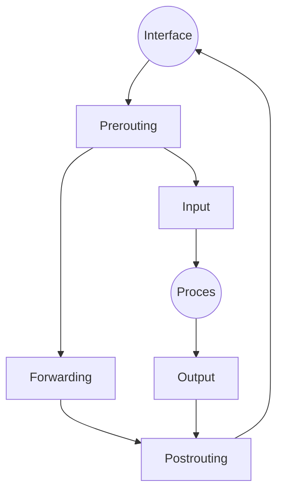

# Reglas

## Input Output
## Forward
## Mangle
## NAT
# Iptables
Opciones:
- -F, elimina las reglas.
- -x, elimina las cadenas.
- -P \<Regla> \<acción>, selecciona las políticas por defecto.
- -A \<Regla>, añadir filtros.
	- -i, interfaz a usar.
	- -j \<acción>, acción a realizar.
	- -s \<ip>, origen.
	- -d \<ip>, destino.
	- -p \<protocolo>, protocolo a filtrar.
		- --dport \<puerto>, puerto destino.
		- --sport \<puerto>, puerto origen.