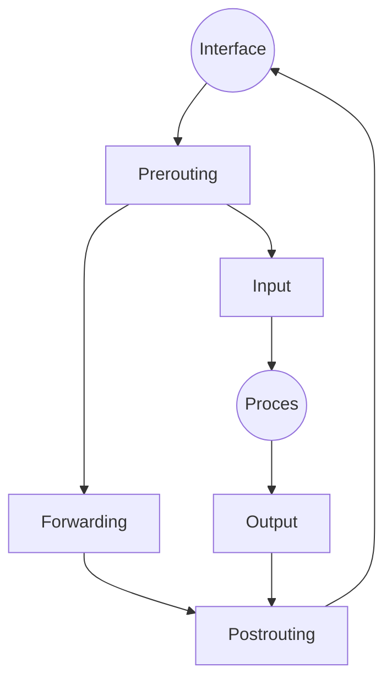

# Reglas

## Input Output
## Forward
## Mangle
## NAT
# Iptables
Opciones:
- -F, elimina las reglas.
- -x, elimina las cadenas.
- -P \<Regla> \<acción>, selecciona las políticas por defecto.
- -A \<Regla>, añadir filtros.
	- -i, interfaz a usar.
	- -j \<acción>, acción a realizar.
	- -s \<ip>, origen.
	- -d \<ip>, destino.
	- -p \<protocolo>, protocolo a filtrar.
		- --dport \<puerto>, puerto destino.
		- --sport \<puerto>, puerto origen.
- -m <extensión>, cargar extensiones (conntrack).
	- --estate \<estado> (NEW, ESTABLISHED, RLATED)
Reglas óptimas:
- Control de estado base
```shell
//aceptado de lo ya establecido
iptables -A INPUT -m conntrack --estate ESTABLISHED, RELATED -j ACCEPT
iptables -A OUTPUT -m conntrack --estate ESTABLISHED, RELATED -j ACCEPT
```
- Control de estado NEW
```shell
iptables -A INPUT -P TCP --dport 22 -s 10.11.30.0/24 -d 10.11.48.143 -m conntrack --estate NEW -j ACCEPT
```
- A varios puertos
```shell
-i ens33 ... -m multiport 22,80,443,...
```
- respuestas
```
iptables -A INPUT -P TCP -j REJECT --rejectwith tcp-reset
```

IMPORTANTES, IPTABLES NO PERSISTENTES