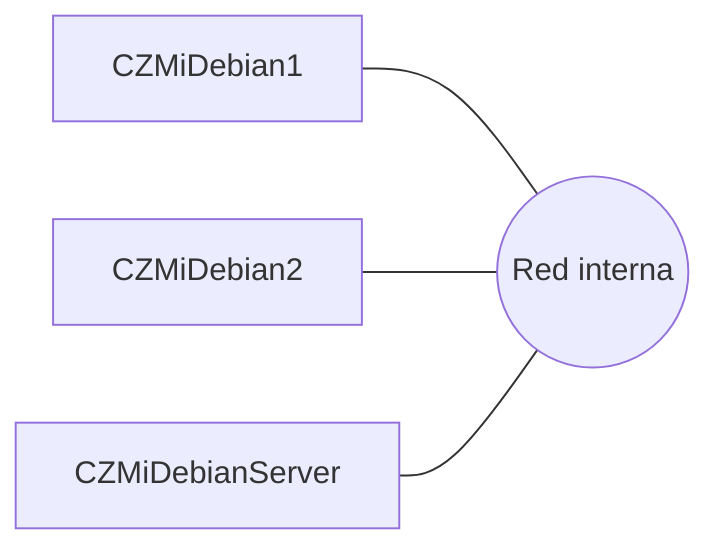

# Red de máquinas

# Conceptos
- Clonar, hacer una copia exacta.
- Desplegar, replicar una imagen en n clientes.
- PXE, arranque de máquinas en remoto con instalación en caliente.
	- BootROM, soporte de pxe en hardware.
	- Etherboot, soporte por tarjeta de red.
- WOL, protocolo que permite arrancar una máquina en remoto mediante una máquina local (router) con necesidades de configuración de la misma.
- 