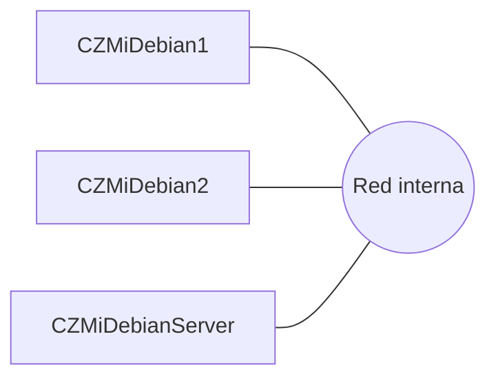

# Red de máquinas

```mermaid
flowchart LR
	D1[CZMiDebian1]
	D2[CZMiDebian2]
	DS[CZMiDebianServer]
	R((Red interna))
	D1---R
	D2---R
	DS---R
```
# Conceptos
- Clonar, 
- Desplegar, replicar una imagen en n clientes