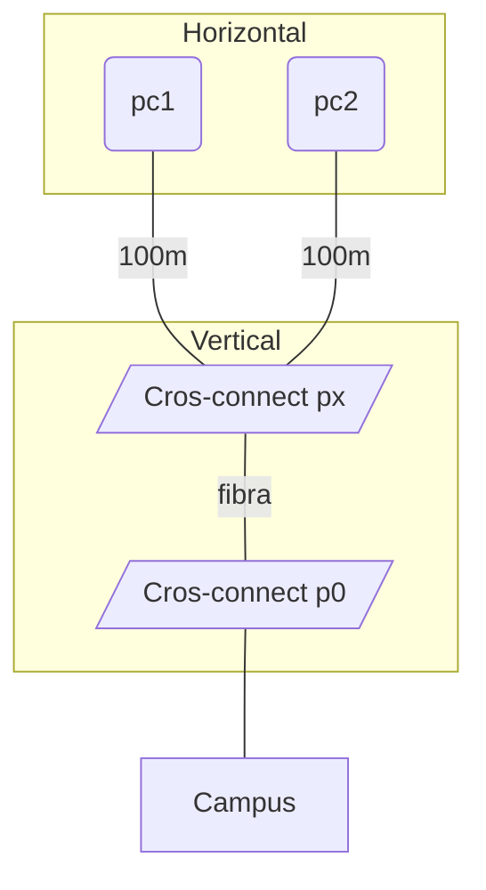

# Medio de transmisión
## Cable de pares
Permite altas distancias con bajas frecuencias en el cobre (cable telefónico), esto lleva a una baja velocidad.
## Par trenzado
Formado por dos hilos conductores entrelazados, el número de pares puede variar, siendo cuatro el estándar. Dentro de este tipo de cables tenemos múltiples tipos:
- UTP, pares sin apantallamiento.
- FTP, pares con pantalla exterior.
- STP, pares con pantallas por pares.

El estándar EIA-568 divide los cables en:

| Categoría | MHz  | máximo Gb | 
| --------- | ---- | --------- |
| 5e        | 100  | 1         |
| 6         | 250  | 1         |
| 6A        | 500  | 10        |
| 7         | 600  | 10        |
| 7A        | 1000 | 10        |
| 8         | 2000 | 40        |
## Fibra óptica
La fibra óptica es más delicada, pero permite trasmisión y distancias de trasmisión de órdenes de magnitud superior al cobre, pero con alto coste. Tenemos dos tipos:
- Monomodo, prioriza la distancia sobre la velocidad.
- Multimodo, prioriza la velocidad sobre la distancia.
Los principales tipos de conectores son:
- ST
- SC
- LC
- LC multimodo dúplex
# Arquitectura
La arquitectura se centra en cableado horizontal, vertical y campus.

## Red jerárquica
En el modelo jerárquico se divide la red en tres partes:
- Acceso, acceso a los usuarios finales.
	- Capa 2.
	- Ancho de banda completo.
	- Seguridad de puerto (no muy usado).
	- Spanning tree (bucle de tráfico).
	- PoE (alimentación).
- Distribución, conectividad basada en directivas.
	- Balanceo de carga y redundancias.
	- Agregación de conexiones.
	- VLANs.
	- Enrutamiento entre VLANs.
	- ACLs.
- Núcleo, transporte rápido entre redes unidas.
	- Alta velocidad y baja latencia.
	- Mínima manipulación.
	- Alta disponibilidad y tolerancia.
## Red corporativa
Estructura utilizada para redes de alto tamaño, dividiendo en áreas:
- Campus.
- Frontera corporativa.
- Proveedor de servicios.
- Acceso remoto.
# Cableado en un CPD
En un cpd tenemos routers de salida y una distribución interna:
- EoR/MoR, los comienzos o finales de línea tienen la concentración de los equipos de distribución.
- ToR, los racks tienen en sus huecos superiores individuales.