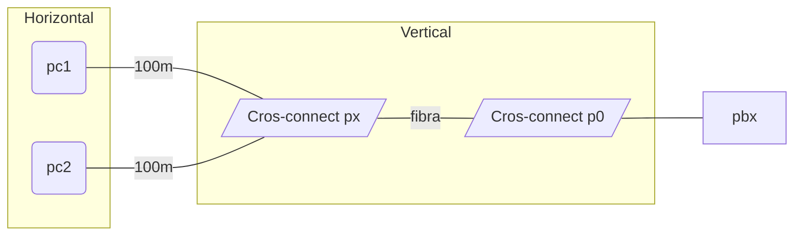

# Cableado estructurado
## Medio de transmisión
### Cable de pares
Permite altas distancias con bajas frecuencias en el cobre (cable telefónico), esto lleva a una baja velocidad.
### Par trenzado
Formado por dos hilos conductores entrelazados, el número de pares puede variar, siendo cuatro el estándar. Dentro de este tipo de cables tenemos múltiples tipos:
- UTP, pares sin apantallamiento.
- FTP, pares con pantalla exterior.
- STP, pares con pantallas por pares.

El estándar EIA-568 divide los cables en:

| Categoría | MHz  | máximo Gb | 
| --------- | ---- | --------- |
| 5e        | 100  | 1         |
| 6         | 250  | 1         |
| 6A        | 500  | 10        |
| 7         | 600  | 10        |
| 7A        | 1000 | 10        |
| 8         | 2000 | 40        |
### Fibra óptica
La fibra óptica es más delicada, pero permite trasmisión y distancias de trasmisión de órdenes de magnitud superior al cobre, pero con alto coste. Tenemos dos tipos:
- Monomodo, prioriza la distancia sobre la velocidad.
- Multimodo, prioriza la velocidad sobre la distancia.
Los principales tipos de conectores son:
- ST
- SC
- LC
- LC multimodo dúplex
## Arquitectura
La arquitectura se centra en cableado horizontal, vertical y campus.

# Redes de almacenamiento
# Visualización de red
# Organización de un CPD
# Fundamentos de ITIL
# Virtualización de servidores