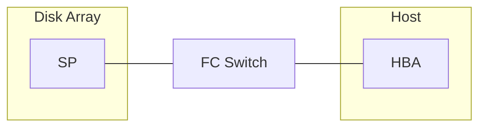
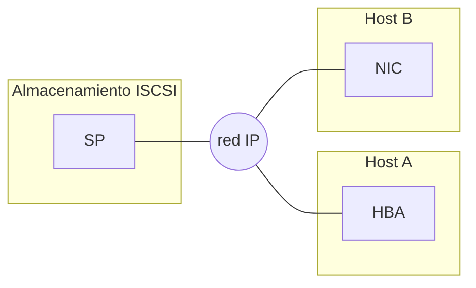

# Sistemas de almacenamiento
## Modos de transferencia
Tenemos do principales modos de trasferencia de datos:
- Bloque, solicitud de bloques concretos de la memoria, permitiendo un acceso preciso pero obtuso para el uso por usuarios.
- Fichero, solicitudes de ficheros con la recopilación de los bloques que lo componen, permitiendo facilidad de empleo del mismo pero con menor eficiencia.
## Almacenamiento tradicional
El almacenamiento tradicionalmente usado son las cabinas de discos, compuestas de los siguientes componentes:
- Controladora, sistema que procesa las peticiones de bloques.
- Bandeja de discos, chasis que aloja los discos, pudiendo ser:
	- SAS
	- SATA
	- NVMe
Estos componentes dividen el sistema en partes:
- Agregado, conjunto físico de discos.
- Volumen, representación lógica del almacenamiento.
- LUN, conjunto de bloques en un volumen.

### Direct attach storage (DAS)
Conexión de manera local usando discos externos, este tipo de conexión tiene una única conexión llevando a cuellos de botella y un gran punto crítico.
### Network attched storage (NAS)
Conexión mediante red TCP/IP para compartiendo la capacidad de almacenamiento, esto ofrece ventajas como:
- Menor coste al usar la red existente.
- Gestión sencilla.
- Menor rendimiento al usar tcp/ip.
- Menor fiabilidad.
### Storage area network (SAN)
Conexión mediante una red específica de almacenamiento, dando gran fiabilidad, disponibilidad y rendimiento (red estrella), para conectarse a la red necesitamos de tarjetas con conectividad SAN, pudiendo ser:
- MMF, para largas distancias.
- SMF, para cortas distancias.
- UTP (cobre).
#### Fibre Channel

Arquitectura SAN pensada para el intercambio de bloques modelada completamente:
- FC-0, Interfaz física
- FC-1, Protocolo de trasmisión
- FC-2, Protocolo de señalización
- FC-3, Servicios comunes
- FC-4, Mapeo de protocolos
Dentro de esta arquitectura tenemos tres topologías:
- FC-P2P (punto a punto), conexión directa de equipos permitiendo conectividad.
- FC-AL ()
#### ISCSI
