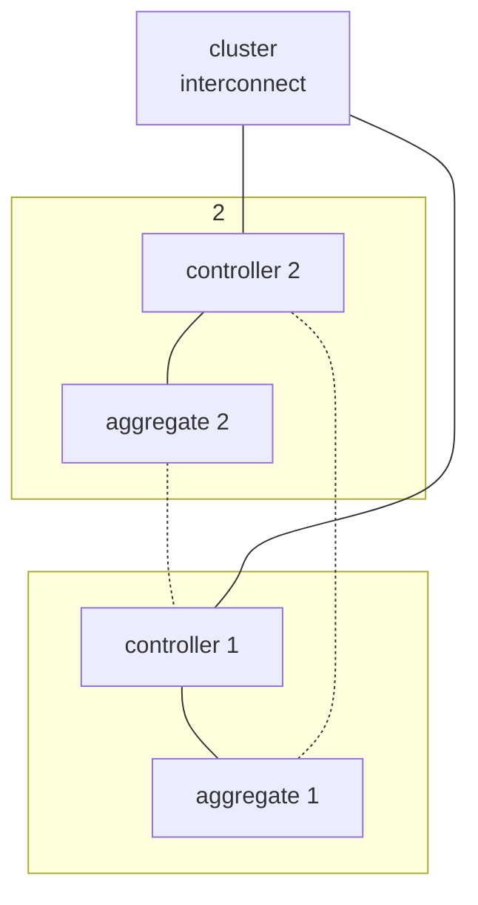

# Sistemas de almacenamiento
## Modos de transferencia
Tenemos do principales modos de trasferencia de datos:
- Bloque, solicitud de bloques concretos de la memoria, permitiendo un acceso preciso pero obtuso para el uso por usuarios.
- Fichero, solicitudes de ficheros con la recopilación de los bloques que lo componen, permitiendo facilidad de empleo del mismo pero con menor eficiencia.
## Almacenamiento tradicional
El almacenamiento tradicionalmente usado son las cabinas de discos, compuestas de los siguientes componentes:
- Controladora, sistema que procesa las peticiones de bloques.
- Bandeja de discos, chasis que aloja los discos, pudiendo ser:
	- SAS
	- SATA
	- NVMe

