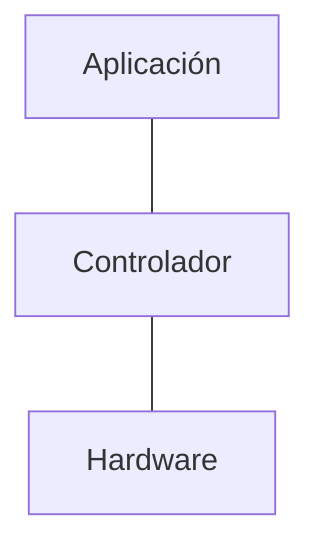

Para manejar el gran número de máquinas virtuales ha llevado a la virtualización de las redes, perdiendo velocidad pero aumentando la flexibilidad.
- NFV (virtualización de funciones), servicios de red son virtualizados en hardware abierto, acelerando el despliegue.
- SDN (redes definidas por software), separación del envío de datos del sistema de control, permitiendo programar el control, haciéndolo dinámico.
# NFV

# SND

	- 
