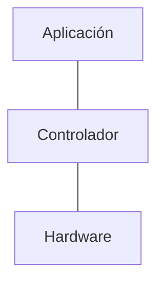

Para manejar el gran número de máquinas virtuales ha llevado a la virtualización de las redes, perdiendo velocidad pero aumentando la flexibilidad.
# NFV
Virtualización de funciones, servicios de red son virtualizados en hardware abierto, acelerando el despliegue.
# SND
Redes definidas por software), separación del envío de datos del sistema de control, permitiendo programar el control, haciéndolo dinámico.

## Programación
- Northbound API, gran variedad de servicios.
- Southbound API, conexión con equipos de red para cambios en tiempo real.
### Controladores libres