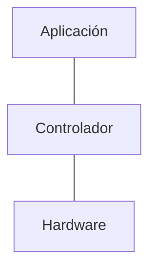

Para manejar el gran número de máquinas virtuales ha llevado a la virtualización de las redes, perdiendo velocidad pero aumentando la flexibilidad.
# SND
Redes definidas por software), separación del envío de datos del sistema de control, permitiendo programar el control, haciéndolo dinámico.

## Programación
- Northbound API, gran variedad de servicios.
- Southbound API, conexión con equipos de red para cambios en tiempo real.
### Controladores
## TCAM
La TCAM es la memoria del sistema, siendo terciaria y basada en la búsqueda de datos en lugar de la búsqueda de direcciones.
## OpenFlow
Protocolo principal del SND que estipula la programación remota de la red, permitiendo establecer reglas de flujo sobre la red (similar a un firewall).
### Open VSwitsh
Switch virtual, usado principalmente para establecer comunicación entre máquinas virtuales sin salir a la red real, reduciendo el tráfico de la misma. Permite la creación de VLANs, monitoreo, QoS, …
# NFV
Virtualizaciones servicios realizados por hardware a su versión virtualizada, estableciéndolo sobre hardware genérico. Permitiendo una alta velocidad de despliegue y escalabilidad, dando una mayor velocidad de retorno y adaptabilidad de las capacidades al cliente.
## Cadenas de servicios
Creación de servicios aplicables a distintos tipos de tráfico, permitiendo la alta personalización de los servicios.
## Características
- Sencillez, interfaces web, cli, api.
- Administración, control y monitoreo de recursos.
- Almacén distribuido, 
- Elasticidad
- Seguridad
## Arquitectura