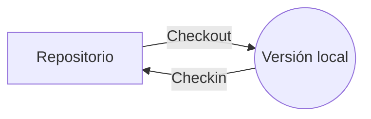

# Introducción
Coordinación del desarrollo de software, reduciendo los errores y facilitando la resolución de los que eventualmente aparezcan. Uno de los principales elementos en este proceso es la trazabilidad del proceso software.
# Objetivos
Facilitar la visibilidad en estado e historia de la versión con la que se trabaja. Esto se consigue con:
- Visibilidad.
	- Estado.
	- Evolución.
- Integridad.
	- Satisfacer las necesidades del usuario.
	- Cumplimiento de requisitos.
	- Trazabilidad desde la concepción al fin.
Las principales actividades para cumplir lo anteriormente mencionado:
- Identificar las configuraciones.
- Control de cambios.
- Gestión de informes de estado.
- Autoría de configuración.
# Conceptos básicos
- La **configuración del software** es la información del conjunto de productos utilizados o generados por el proyecto como resultado del proyecto de ingeniería software.
- **ECS** es un elemento de configuración del software, es la unidad mínima de trabajo del GCS, siendo cada uno de los componentes de la configuración software.
- **Línea base** es la recopilación de ECSs siendo un punto de referencia en el proyecto de desarrollo, los ECS se pueden modificar libremente previamente a ser introducidos en una línea base, obligando a segur un proceso formal de cambios.
# Aspectos relacionados
## Control de versiones
El control de versiones facilita la GCS permitiendo la relación de versiones y recuperación de las mismas.
### Versión
Instancia de un ECS en un momento de desarrollo almacenada en un repositorio con disponibilidad para su recuperación y modificación.
### Revisión
Son lo mismo que versión desde la vista del estándar, en las empresas se le suele considerar cambios menores.
### Modelo de trabajo

El repositorio almacena las versiones que son solicitadas por el local y modificadas para luego subidas al repositorio. El almacenamiento se realiza normalmente con el almacenamiento completo de unas pocas versiones, con el almacenamiento de los cambios sobre las mismas, siendo a estos llamados el delta y teniendo dos principales:
- Directo, se almacenan los cambios desde la versión inicial.
- Inverso, se almacenan los cambios desde la versión final.
También podemos diferenciar por localización:
- Separados
- Mezclados
### Variantes
Ramificaciones del grafo de modificación base, habiendo tres tipos:
- Temporales, ramificaciones con vida limitada.
- Usar y tirar, variantes de un solo uso (pruebas).
- Permanentes, ramas que continúan de manera separada.
La creación de variantes produce la aparición de configuraciones alternativas, definidas por los ECS y versiones de los mismos. Esto se puede facilitar con la asignación de atributos a los ECSs.
# Release
Las configuraciones entregadas al cliente, debe ser identificada y tener una GCS asociada.
# Ejemplo práctico
Proceso de gestión de configuraciones software:
1. Portada, con firmas de los responsables.
2. Versionado.
3. Distribución.
4. Proceso GCS.
	1. Elementos de configuración.
		1. Documentación.
		2. Software.
	2. Línea base.
	3. Registros de configuración.
	4. Procedimiento de control de cambios.
		1. Registro de solicitudes de cambio.
		2. Analisis de las 