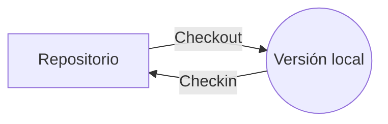

# Introducción
Coordinación del desarrollo de software, reduciendo los errores y facilitando la resolución de los que eventualmente aparezcan. Uno de los principales elementos en este proceso es la trazabilidad del proceso software.
# Objetivos
Facilitar la visibilidad en estado e historia de la versión con la que se trabaja. Esto se consigue con:
- Visibilidad.
	- Estado.
	- Evolución.
- Integridad.
	- Satisfacer las necesidades del usuario.
	- Cumplimiento de requisitos.
	- Trazabilidad desde la concepción al fin.
Las principales actividades para cumplir lo anteriormente mencionado:
- Identificar las configuraciones.
- Control de cambios.
- Gestión de informes de estado.
- Autoría de configuración.
# Conceptos básicos
- La **configuración del software** es la información del conjunto de productos utilizados o generados por el proyecto como resultado del proyecto de ingeniería software.
- **ECS** es un elemento de configuración del software, es la unidad mínima de trabajo del GCS, siendo cada uno de los componentes de la configuración software.
- **Línea base** es la recopilación de ECSs siendo un punto de referencia en el proyecto de desarrollo, los ECS se pueden modificar libremente previamente a ser introducidos en una línea base, obligando a segur un proceso formal de cambios.
# Aspectos relacionados
## Control de versiones
El control de versiones facilita la GCS permitiendo la relación de versiones y recuperación de las mismas.
### Versión
Instancia de un ECS en un momento de desarrollo almacenada en un repositorio con disponibilidad para su recuperación y modificación.
### Revisión
Son lo mismo que versión desde la vista del estándar, en las empresas se le suele considerar cambios menores.
### Modelo de trabajo

El repositorio almacena las versiones que son solicitadas por el local y modificadas para luego subidas al repositorio. El almacenamiento se realiza normalmente con el almacenamiento completo de unas pocas versiones con el almacenamiento de los cambios sobre las mismas.