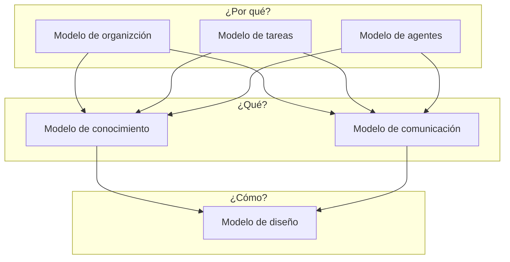

# Ingeniería de conocimiento y SBCs
Las dos principales definiciones son:
- Ingeniería de conocimiento
	- Disciplina para la aproximación sistemática, disciplinada y cuantificable.
- Sistemas basados en conocimiento
	- Sistemas que utilizan conocimiento explícito en un sistema para realizar acciones.

Estos sistemas SBC son caracterizados por:
- Dominio.
- Mantenimiento perfectivo continuo.
- Reutilización de software.
- Justificación y explicación.
- Conocimiento explícito (datos en el propio sistema).

Las ventajas y limitaciones de los sistemas SBC son:
- Ventajas
	- Mantenimiento del conocimiento.
	- Resolución de problemas complejos.
	- Ajuste de objetivos.
	- Tratamiento de la incertidumbre.
	- Explicación del razonamiento.
	- Reducción de costes.
	- Aumento de la fiabilidad.
	- Modularidad.
- Limitaciones
	- Dificultad en la adquisición de conocimiento.
	- Reutilización del conocimiento.
	- Falta de creatividad y sentido común.
	- Obstáculos para el aprendizaje y la adaptación.

# Metodologías adaptadas de la SI
# Metodologías de modelado de conocimiento

# Metodología CommonKADS
La metodología commonKADS es un estándar basado en el modelado, reutilización y gestión de riesgo. Los productos producidos son comprendidos por la organización, tareas, agentes, conocimiento, comunicación y diseño.

